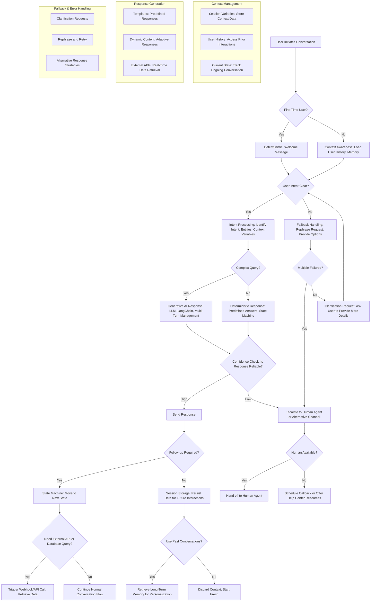

```mermaid
graph TD
    A[Agent Startup] --> B{Token Storage Available?}
    
    %% Initial Token Acquisition
    B -->|No| C[Initial Authentication Flow]
    B -->|Yes| D[Load Encrypted Tokens]
    
    C --> C1{Authentication Method}
    C1 -->|Client Credentials| C2[Client Credentials Flow]
    C1 -->|Device Code| C3[Device Code Flow]
    C1 -->|Service Account| C4[JWT Service Account]
    
    %% Client Credentials Flow
    C2 --> C2a[POST /oauth/token<br/>grant_type=client_credentials<br/>client_id + client_secret]
    C2a --> C2b[Receive Access Token + Expires]
    C2b --> E[Store Encrypted Tokens]
    
    %% Device Code Flow
    C3 --> C3a[POST /oauth/device<br/>Request Device Code]
    C3a --> C3b[Display QR Code + User Code]
    C3b --> C3c[Poll Token Endpoint<br/>Every N Seconds]
    C3c --> C3d{Authorization Status}
    C3d -->|Pending| C3c
    C3d -->|Approved| C3e[Receive Tokens]
    C3d -->|Expired/Denied| C3f[Authentication Failed]
    C3e --> E
    
    %% JWT Service Account
    C4 --> C4a[Generate JWT Token<br/>RS256 Signature]
    C4a --> C4b[Include Agent Claims<br/>permissions, exp, iat]
    C4b --> E
    
    %% Token Storage
    D --> F[Decrypt with PBKDF2 + Fernet]
    E --> E1[PBKDF2 Key Derivation<br/>100k iterations]
    E1 --> E2[Fernet Encryption]
    E2 --> E3[Store to Disk/Redis]
    F --> G{Token Valid?}
    
    %% Token Validation
    G -->|Yes| H[Use Existing Token]
    G -->|No/Expired| I[Token Refresh Flow]
    
    %% Distributed Token Management
    I --> I1{Multiple Agent Instances?}
    I1 -->|Yes| I2[Redis Distributed Lock]
    I1 -->|No| I5[Local Thread Lock]
    
    I2 --> I3[SET lock_key NX EX 30]
    I3 --> I4{Lock Acquired?}
    I4 -->|Yes| I5
    I4 -->|No| I6[Wait + Retry]
    I6 --> I7[GET token from Redis]
    I7 --> H
    
    %% Token Refresh
    I5 --> J[Refresh Token Request]
    J --> J1[POST /oauth/token<br/>grant_type=refresh_token]
    J1 --> J2{Refresh Success?}
    J2 -->|Yes| J3[Update Token Store]
    J2 -->|No| K[Re-authenticate]
    K --> C
    
    J3 --> J4[Release Lock]
    J4 --> H
    
    %% API Request Flow
    H --> L[Agent Makes API Request]
    L --> L1{Direct or Proxy?}
    
    %% Direct API Call
    L1 -->|Direct| L2[Add Authorization Header<br/>Bearer {token}]
    L2 --> L3[HTTP Request to API]
    L3 --> L4{Response Status}
    L4 -->|401 Unauthorized| M[Token Expired]
    L4 -->|200-299| N[Success Response]
    L4 -->|Rate Limited| O[Backoff + Retry]
    
    M --> I
    O --> P[Exponential Backoff]
    P --> L3
    
    %% Proxy Pattern
    L1 -->|Proxy| Q[Token Proxy Service]
    Q --> Q1[Validate Agent JWT]
    Q1 --> Q2{Agent Valid?}
    Q2 -->|No| Q3[401 Unauthorized]
    Q2 -->|Yes| Q4[Get Service Token]
    Q4 --> Q5[Forward Request with Service Token]
    Q5 --> Q6[Return Response to Agent]
    Q6 --> N
    
    %% Async Flow Management
    L3 --> R{Async Client?}
    R -->|Yes| R1[aiohttp Session Pool]
    R1 --> R2[Non-blocking I/O]
    R2 --> R3[Connection Reuse]
    R3 --> L4
    R -->|No| L4
    
    %% Error Handling
    N --> S[Continue Agent Operations]
    Q3 --> T[Log Security Event]
    C3f --> U[Fallback Auth Method]
    U --> C1
    
    %% Cleanup
    S --> V{Agent Shutdown?}
    V -->|Yes| W[Close HTTP Sessions]
    W --> X[Release All Locks]
    X --> Y[Secure Token Cleanup]
    V -->|No| Z[Monitor Token Expiry]
    Z --> AA[Background Refresh Timer]
    AA --> G
    
    %% Styling
    classDef authFlow fill:#e1f5fe
    classDef tokenMgmt fill:#f3e5f5
    classDef security fill:#ffebee
    classDef apiCall fill:#e8f5e8
    classDef error fill:#fff3e0
    
    class C,C1,C2,C3,C4,C2a,C2b,C3a,C3b,C3c,C3d,C3e,C4a,C4b authFlow
    class E,F,G,I,I1,I2,I3,I4,I5,J,J1,J2,J3,J4 tokenMgmt
    class E1,E2,Q1,Q2,T,Y security
    class H,L,L1,L2,L3,L4,N,Q,Q4,Q5,Q6,R,R1,R2,R3 apiCall
    class M,O,P,C3f,U,Q3 error
```
