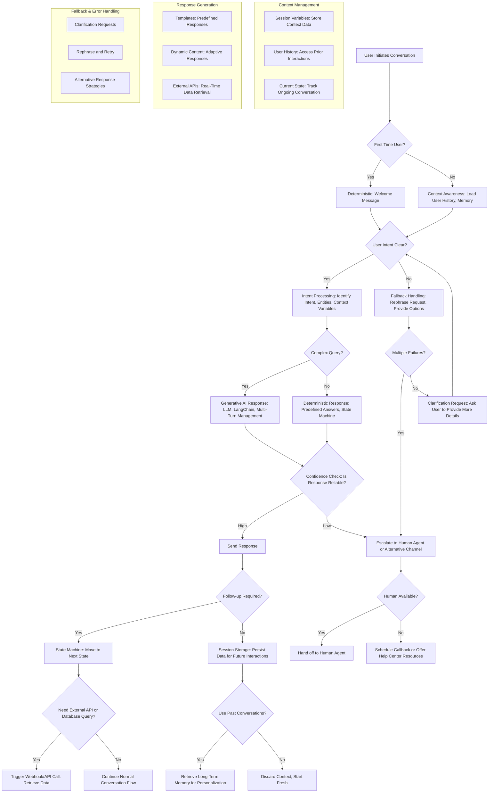

```mermaid
graph LR
    A[Start] --> B{Crew Member Staffed at Present Window 2?};
    B -- Yes --> C{Order Ready?};
    B -- No --> X[Initial Decision: Direct car to Window 1 for Cash];

    C -- Yes --> D{Car at Window 1?};
    C -- No --> E{Car at Window 1?};

    D -- No --> F[Direct car to Window 1 for Cash & Present];
    D -- Yes --> F

    E -- Yes --> G{Car at Window 2?};
    E -- No --> H{Car at Window 2?};

    G -- No --> I[Indicate to customer: "Please wait for window assignment" until car in window 1 starts to move, then Direct car to Window 1 if order is ready or Window 2 if not ready];
    G -- Yes --> I

    H -- No --> J[Direct car to Window 2 for Cash & Present];
    H -- Yes --> K[Indicate to customer: "Please wait for window assignment" until car in window 1 starts to move, then Direct car to Window 1 if order is ready or Window 2 if not ready];
    
    X --> Y{Order Ready?};
    Y -- Yes --> Z[Direct the car to Window 1 for Cash];
    Y -- No --> Z

    F --> L[Reprioritization Needed?];
    I --> L
    J --> L
    K --> L
    Z --> M[Reprioritization Needed?];

    L -- Yes --> N{Car pays at Window 1, order not ready, car at Window 2 leaves, car 1 spot before Present Window 1?};
    M -- Yes --> O{Car pays at Window 1, order not ready, no car at Window 2 or car at Window 2 leaves, car 1 spot before Present Window 1?};
    L -- No --> P[End];
    M -- No --> P

    N -- Yes --> Q[Direct car at Window 1 to pull forward to Present Window 2];
    N -- No --> P
    O -- Yes --> Q
    O -- No --> P

    Q --> P
```
