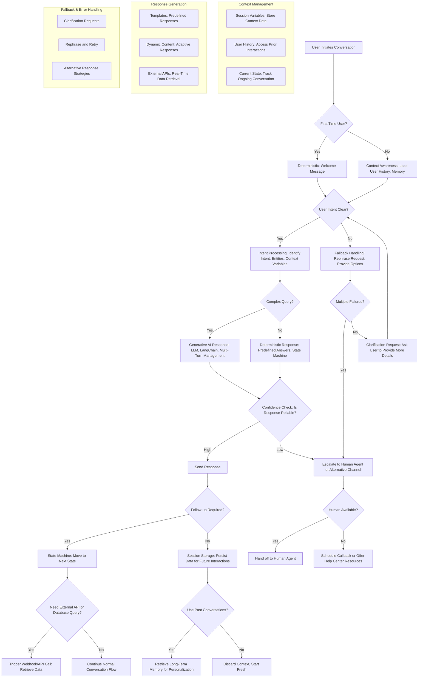
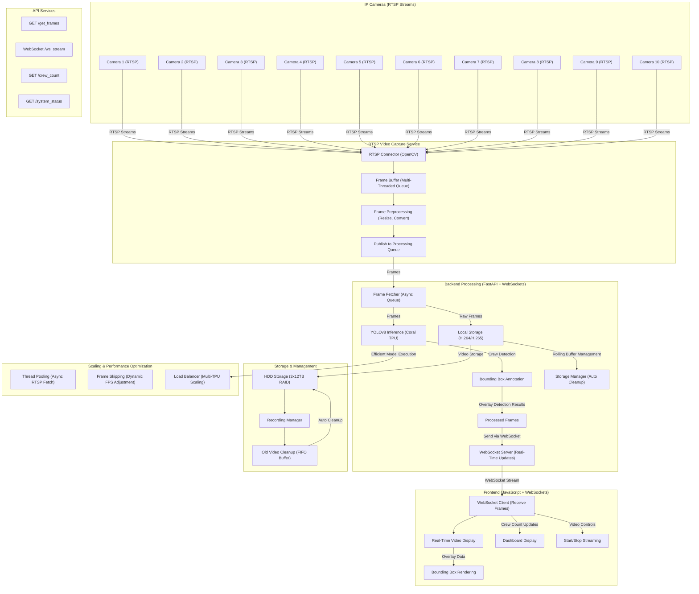

```mermaid
flowchart TD

  %% User Entry Points
  A[User Initiates Conversation] --> B{First Time User?}
  
  %% First-time user vs Returning user handling
  B -- Yes --> C[Deterministic: Welcome Message]
  B -- No --> D[Context Awareness: Load User History, Memory]
  
  %% Understanding User Intent
  C --> E{User Intent Clear?}
  D --> E

  %% If intent is clear, process it
  E -- Yes --> F[Intent Processing: Identify Intent, Entities, Context Variables]
  E -- No --> G[Fallback Handling: Rephrase Request, Provide Options]

  %% Handling fallback scenarios
  G --> Q{Multiple Failures?}
  Q -- Yes --> M[Escalate to Human Agent or Alternative Channel]
  Q -- No --> R[Clarification Request: Ask User to Provide More Details]
  R --> E

  %% Processing recognized intent
  F --> H{Complex Query?}
  H -- Yes --> I[Generative AI Response: LLM, LangChain, Multi-Turn Management]
  H -- No --> J[Deterministic Response: Predefined Answers, State Machine]

  %% Confidence Check for Response
  I --> K{Confidence Check: Is Response Reliable?}
  J --> K
  K -- High --> L[Send Response]
  K -- Low --> M

  %% Managing Session Continuity and Follow-Ups
  L --> N{Follow-up Required?}
  N -- Yes --> O[State Machine: Move to Next State]
  N -- No --> P[Session Storage: Persist Data for Future Interactions]

  %% External Integrations
  O --> Y{Need External API or Database Query?}
  Y -- Yes --> Z[Trigger Webhook/API Call: Retrieve Data]
  Y -- No --> AA[Continue Normal Conversation Flow]

  %% Personalization and Memory Usage
  P --> BB{Use Past Conversations?}
  BB -- Yes --> CC[Retrieve Long-Term Memory for Personalization]
  BB -- No --> DD[Discard Context, Start Fresh]

  %% Escalation Handling
  M --> EE{Human Available?}
  EE -- Yes --> FF[Hand off to Human Agent]
  EE -- No --> GG[Schedule Callback or Offer Help Center Resources]

  %% Parallel subgraphs
  subgraph "Context Management"
      S[Session Variables: Store Context Data]
      T[User History: Access Prior Interactions]
      U[Current State: Track Ongoing Conversation]
  end

  subgraph "Response Generation"
      V[Templates: Predefined Responses]
      W[Dynamic Content: Adaptive Responses]
      X[External APIs: Real-Time Data Retrieval]
  end

  subgraph "Fallback & Error Handling"
      HH[Clarification Requests]
      II[Rephrase and Retry]
      JJ[Alternative Response Strategies]
  end
```

```mermaid
graph TD;

    %% IP Cameras Streaming Data
    subgraph "IP Cameras (RTSP Streams)"
        C1["Camera 1 (RTSP)"] 
        C2["Camera 2 (RTSP)"]
        C3["Camera 3 (RTSP)"]
        C4["Camera 4 (RTSP)"]
        C5["Camera 5 (RTSP)"]
        C6["Camera 6 (RTSP)"]
        C7["Camera 7 (RTSP)"]
        C8["Camera 8 (RTSP)"]
        C9["Camera 9 (RTSP)"]
        C10["Camera 10 (RTSP)"]
    end

    %% RTSP Video Capture Service
    subgraph "RTSP Video Capture Service"
        V1["RTSP Connector (OpenCV)"] --> V2["Frame Buffer (Multi-Threaded Queue)"]
        V2 --> V3["Frame Preprocessing (Resize, Convert)"]
        V3 --> V4["Publish to Processing Queue"]
    end

    %% Backend Processing
    subgraph "Backend Processing (FastAPI + WebSockets)"
        B1["Frame Fetcher (Async Queue)"] -->|Frames| B2["YOLOv8 Inference (Coral TPU)"]
        B2 -->|Crew Detection| B3["Bounding Box Annotation"]
        B3 -->|Overlay Detection Results| B4["Processed Frames"]
        B4 -->|Send via WebSocket| B5["WebSocket Server (Real-Time Updates)"]
        B1 -->|Raw Frames| B6["Local Storage (H.264/H.265)"]
        B6 -->|Rolling Buffer Management| B7["Storage Manager (Auto Cleanup)"]
    end

    %% API Services
    subgraph "API Services"
        A1["GET /get_frames"]
        A2["WebSocket /ws_stream"]
        A3["GET /crew_count"]
        A4["GET /system_status"]
    end

    %% Frontend System
    subgraph "Frontend (JavaScript + WebSockets)"
        F1["WebSocket Client (Receive Frames)"] --> F2["Real-Time Video Display"]
        F2 -->|Overlay Data| F3["Bounding Box Rendering"]
        F1 -->|Crew Count Updates| F4["Dashboard Display"]
        F1 -->|Video Controls| F5["Start/Stop Streaming"]
    end

    %% Storage & Management
    subgraph "Storage & Management"
        S1["HDD Storage (3x12TB RAID)"]
        S2["Recording Manager"]
        S3["Old Video Cleanup (FIFO Buffer)"]
        S1 --> S2
        S2 --> S3
    end

    %% Performance Scaling
    subgraph "Scaling & Performance Optimization"
        P1["Thread Pooling (Async RTSP Fetch)"]
        P2["Frame Skipping (Dynamic FPS Adjustment)"]
        P3["Load Balancer (Multi-TPU Scaling)"]
    end

    %% Connections
    C1 & C2 & C3 & C4 & C5 & C6 & C7 & C8 & C9 & C10 -->|RTSP Streams| V1
    V4 -->|Frames| B1
    B5 -->|WebSocket Stream| F1
    B6 -->|Video Storage| S1
    S3 -->|Auto Cleanup| S1
    B2 -->|Efficient Model Execution| P3
```
