# Goal

Develop a secure web application using Python/Flask for the backend and HTML/JavaScript for the frontend. 
This application will implement CRUD (Create, Read, Update, Delete) functionality, allowing users to create new entries, update, read, and delete existing ones.

Entries will be displayed in a tabular format on the frontend. Each row will include two action buttons—one for updating and another for deleting the respective entry. Additionally, a button positioned at the top center of the webpage will allow users to add new entries.

The application will use Google Cloud Firestore as its database. 
It will be deployed on Google Cloud Run using Docker, with a CI/CD pipeline managed via Cloud Build.

# User Management & Security

This system will support multiple users, each having an isolated session to ensure strict data segregation. Each user will have access only to their own personalized database to prevent unauthorized data access. Session management must be robustly secured, incorporating secure cookies for authentication and personalization.

# Security Objectives & Measures

The primary objective of this application is to maximize security. To achieve this, I plan to implement:
- **Strong authentication mechanisms**, including <mask>Identity-Aware Proxy (IAP)</mask> for secure authentication.
- **Comprehensive input sanitization** to mitigate security vulnerabilities such as <mask>XSS</mask>, <mask>SQL/NoSQL injection</mask>, and <mask>CSRF attacks</mask>.
- **Strict HTTP security headers** to enhance protection against various <mask>web threats</mask>.
- **Secure communication protocols**, including mandatory <mask>HTTPS enforcement</mask> and proper <mask>CORS configuration</mask>.
- **Robust API security**, ensuring <mask>JWT-based authentication</mask> and </mask>fine-grained role-based access control (RBAC)</mask>.
- **Rate limiting on all endpoints**
- **Comprehensive error handling** and **Security event logging**, Logging and alerting mechanisms for anomaly detection
- Cloud Run Deployment Security – IAM policies, container security, secrets management, and network security.
- CI/CD Pipeline Security (Cloud Build) – Secure deployments, static code analysis, and artifact scanning.

## Back-End
### Authentication & Authorization

- 👉 Use **Google Identity-Aware Proxy (IAP)** for authentication
- 👉 Restrict **access** using **role-based** or **attribute-based access control** (**RBAC**/**ABAC**).
- 👉 Configure **session management**

```python 
from flask import Flask
app = Flask(__name__)
app.config.update(
    SESSION_COOKIE_SECURE=True,
    SESSION_COOKIE_HTTPONLY=True,
    SESSION_COOKIE_SAMESITE='Strict',
    PERMANENT_SESSION_LIFETIME=timedelta(hours=1)
)
```

### Input Validation & Sanitization

- 👉 Use Flask’s built-in **request validation**
- 👉 Leverage **Marshmallow** (**Pydantic**) for **schema validation**
- 👉 Implement **server-side input sanitization** to prevent NoSQL injection
    - Validate and sanitize all incoming data to prevent SQL/NoSQL injections
    - Set strict schema rules for Firestore entries.
    - Avoid dynamic queries with user inputs
    - Use Firestore’s structured queries instead of raw queries
 
```python 
from pydantic import BaseModel, validator
from typing import Optional

class EntrySchema(BaseModel):
    title: str
    content: str
    user_id: str
    
    @validator('title')
    def title_must_be_valid(cls, v):
        if len(v) > 200:
            raise ValueError('Title too long')
        return v.strip()
```
- 👉 **Restrict allowed content** types for user inputs
- 👉 Use **parameterized queries** for Firestore - to prevent SQL injection

```python
def get_user_entries(user_id: str):
    return db.collection('entries').where('user_id', '==', user_id).get()
```

- 👉Enforce **rate limiting** using **Flask-Limiter** to prevent **DoS attacks**.

```python
from flask_limiter import Limiter
from flask_limiter.util import get_remote_address

limiter = Limiter(
    app,
    key_func=get_remote_address,
    default_limits=["200 per day", "50 per hour"]
)
```

- 👉 Disable Unnecessary HTTP Methods
    - Allow only ```GET```, ```POST```, ```PUT```, and ```DELETE``` where necessary.

- 👉 MIME Type Validation: Verify file types before saving them.
- 👉 Restrict Executable Files: Block .exe, .sh, .php, etc.
- 👉 Use a CDN or Separate Storage: Store user-uploaded files in S3/GCS instead of the main server.

### API Security

- 👉 Implement **secure API endpoints** using **HTTPS** with **HSTS**.
    - Redirect all HTTP traffic to HTTPS using Cloud Load Balancer

- 👉 Use **JWT-based authentication** with **short-lived tokens**.
- 👉 Restrict **CORS** to **trusted domains**

```python
from flask_cors import CORS
CORS(app, resources={r"/*": {"origins": ["https://yourfrontend.com"]}})
```
- 👉 Register **blueprints**

```python
from app.routes import main_bp, auth_bp, api_bp

# Initialize blueprints
main_bp = Blueprint('main', __name__)
auth_bp = Blueprint('auth', __name__)
api_bp = Blueprint('api', __name__)https://mcd-tools.atlassian.net/wiki/spaces/DAAI/overview

@auth_bp.route('/logout')
def logout():
  ...
  session.clear()
  return jsonify({'message': 'Logged out successfully'})

@api_bp.route('/entries', methods=['GET'])
@require_auth
@limiter.limit("100 per minute")
def get_entries():
  ...
  return jsonify({'error': 'Failed to fetch entries'}), 500
```

### Secure Cookies & Sessions
- 👉 Set **Secure**, **HttpOnly**, and **SameSite=strict** on cookies.
- 👉 Store **session data** in **Firestore** or Redis instead of client-side cookies.
- 👉 Use **Flask-Talisman** to enforce strict **HTTP security headers**.

- Implement Security Headers

```python
response.headers['X-Content-Type-Options'] = 'nosniff'
response.headers['X-Frame-Options'] = 'SAMEORIGIN'
response.headers['X-XSS-Protection'] = '1; mode=block'
response.headers['Strict-Transport-Security'] = 'max-age=31536000; includeSubDomains'
response.headers['Cache-Control'] = 'no-store, no-cache, must-revalidate, max-age=0'
```

- 👉 Add **security headers**

```python
from flask_talisman import Talisman

Talisman(app,
    force_https=True,
    strict_transport_security=True,
    session_cookie_secure=True,
    content_security_policy={
        'default-src': "'self'",
        'script-src': "'self' 'unsafe-inline' 'unsafe-eval'",
        'style-src': "'self' 'unsafe-inline'",
    }
)
```

```python
from flask import Flask
from flask_talisman import Talisman

def configure_security(app: Flask):
    csp = {
        'default-src': [
            '\'self\''
        ],
        'script-src': [
            '\'self\'',
            '\'unsafe-inline\''  # Allow inline scripts for development
        ],
        'style-src': [
            '\'self\''
        ]
    }
    Talisman(app, content_security_policy=csp)

    @app.after_request
    def set_security_headers(response):
        response.headers['X-Content-Type-Options'] = 'nosniff'
        response.headers['X-Frame-Options'] = 'SAMEORIGIN'
        response.headers['X-XSS-Protection'] = '1; mode=block'
        response.headers['Strict-Transport-Security'] = 'max-age=31536000; includeSubDomains'
        response.headers['Cache-Control'] = 'no-store, no-cache, must-revalidate, max-age=0'
        return response
```

- 👉 Session Expiry & Revocation: Implement session expiration and logout functionalities properly.

### Prevent CSRF Attacks
- 👉 Use **Flask-WTF** with **CSRF protection** enabled.
- 👉 Include **CSRF tokens** in all POST/PUT/DELETE requests.

### Logging & Monitoring
- 👉 Centralized Logging: Use Flask-Logging with structured logs.
- 👉 Intrusion Detection: Monitor logs for unusual activity.
- 👉 Real-time Alerts: Integrate monitoring tools like Prometheus, Grafana, or ELK Stack.

### Code Security & Hardening
- 👉 Automatic Dependency Updates: Use pip-audit or dependabot to check for vulnerable dependencies.
- 👉 Limit Flask Extensions: Use only well-maintained Flask extensions.
  
## Front-End

- 👉 Avoid Inline JavaScript: Move scripts to external files.
- 👉 Use Subresource Integrity (SRI): Ensure external resources (CDNs) are not tampered with.
- 👉 Disable Client-Side Debugging: Remove debug messages from production.

### Session Management

- 👉 Avoid Storing Sensitive Data in Local Storage
    - Use ```HttpOnly``` and ```Secure cookies``` for session management.
    - Ensure session cookies have Secure, HttpOnly, and SameSite=Strict attributes.
    - Store sensitive data in HttpOnly cookies (not in local storage).

- 👉 Implement session expiration and automatic logout after inactivity
  
 ### XSS Prevention 
- 👉 Sanitize all user inputs before rendering
- 👉 Sanitize user-generated content using DOMPurify
- 👉 Avoid ```innerHTML``` and use ```textContent``` or ```DOMPurify``` for rendering.

```javascript
function sanitizeInput(input) {
    const div = document.createElement('div');
    div.textContent = input;
    return div.innerHTML;
}
```

```javascript
var cleanHtml = DOMPurify.sanitize(dirtyHtml);
```

- 👉 Use **Content Security Policy (CSP)** headers to restrict **inline scripts**

```javascript
<meta http-equiv="Content-Security-Policy" content="default-src 'self'; script-src 'self' https://apis.google.com;">
```

```html
<meta http-equiv="Content-Security-Policy" 
    content="default-src 'self'; 
    script-src 'self' 'unsafe-inline' 'unsafe-eval'; 
    style-src 'self' 'unsafe-inline';">
```
### CSRF Protection

- 👉 Implement CSRF tokens

```javascript
async function makeRequest(url, method, data) {
    const response = await fetch(url, {
        method: method,
        headers: {
            'Content-Type': 'application/json',
            'X-CSRF-Token': document.querySelector('meta[name="csrf-token"]').content
        },
        credentials: 'same-origin',
        body: JSON.stringify(data)
    });
    return response.json();
}
```

- 👉 Prevent Clickjacking Attacks
    - Set ```X-Frame-Options``` in the response headers:

```python
@app.after_request
def set_security_headers(response):
    response.headers["X-Frame-Options"] = "DENY"
    return response
```

## Database Security

### Security Rules

- 👉 Restrict Access Based on User Identity
- 👉 Validate Data on Firestore Side

```powershell
rules_version = '2';
service cloud.firestore {
  match /databases/{database}/documents {
    match /entries/{entryId} {
      allow read: if request.auth != null 
                 && request.auth.uid == resource.data.user_id;
      allow write: if request.auth != null 
                  && request.auth.uid == request.resource.data.user_id;
      
      function validateEntry() {
        let incoming = request.resource.data;
        return incoming.size() <= 1000000
               && incoming.title.size() <= 200
               && incoming.content.size() <= 50000;
      }
    }
  }
}
```

- 👉 ORM-Level Security: Define permissions in ORM models to restrict unauthorized access to data.

### Encryption

- 👉 Use Firestore’s built-in encryption at rest

- 👉 Use IAM to Restrict Access to Firestore

```gcloud
gcloud projects add-iam-policy-binding PROJECT_ID \
  --member=user:you@example.com \
  --role=roles/datastore.user
```

- 👉 Implement field-level encryption for sensitive data

```python
from cryptography.fernet import Fernet

def encrypt_field(data: str) -> str:
    key = Fernet.generate_key()
    f = Fernet(key)
    return f.encrypt(data.encode()).decode()
```

## Deployment Security

- 👉 HTTPS with HSTS: Enforce HTTPS and use Strict-Transport-Security.
- 👉Reverse Proxy (NGINX): Serve Flask via Gunicorn + Nginx with security headers.
- 👉 Container Security: If using Docker, scan images for vulnerabilities.
- 👉 Secrets Management: Use environment variables, AWS Secrets Manager, or HashiCorp Vault.

# M2M Authentication

Machine-to-Machine (M2M) Authentication - 2 approaches:
- **Client credentials flow** - This is the most secure and recommended approach
    - Fine-grained authorization
    - Able to revoke application access easily
      
- **An API key**

## Client Credentials Flow (OAuth 2.0)

1. **Client ID** and **Secret**:
    - Generate a **unique client ID** and a **client secret** for **each trusted application** that needs to access your API.
    - Think of these as the application's **"username"** and **"password"**
    - Store the client secret securely on the client application (using **environment variables** or **secure configuration**).
    - The client application possesses a **client ID** and **client secret** (configured securely).

2. **Token Endpoint**:
    - Your authentication service exposes a **token endpoint** (e.g., `/oauth/token`).

3. **Authentication Request**
    - The **client application** makes an **HTTP POST request to the token endpoint**, including the **client ID** and **client secret** in
        - the **Authorization header** (using Basic authentication) or
        - the **request body**
    - The client application makes a request to the **/oauth/token endpoint** of the authentication service, providing its **client ID** and **client secret**.

```
# Option A - Authorization Header (Basic Auth):
- Authorization: Basic <base64 encoded client_id:client_secret>
- Content-Type: application/x-www-form-urlencoded


# Option B - Request Body (form data):
client_id=your_client_id&client_secret=your_client_secret&grant_type=client_credentials
```

4. **Token Response**
    - The **Authentication service** validates the **client ID** and **client secret**. If valid, it issues an **access token** (**JWT**) and, optionally, **a refresh token**.
    - The **Authentication service** issues the **JWTs**. This service verifies **user credentials** and, upon successful verification, generates **a JWT containing claims** (**user ID**, **roles**, **permissions**, etc.). This service could be:

```
{
    "access_token": "eyJhbGciOiJIUzI1NiIsInR5cCI6IkpXVCJ9...",
    "token_type": "Bearer",
    "expires_in": 3600,  // Seconds
    "refresh_token": "..."  // Optional
}
```

5. **Subsequent API Requests**
    - The client application includes the access token in the Authorization header of subsequent requests to your CRUD API:

```
Authorization: Bearer <access_token>
```

6. **JWT Verification**
    - Our Cloud Function (CRUD API) verifies the **JWT** as described before (**signature**, **expiration**, **audience**, **issuer**).

7. **Authorization**
    - The claims within the **JWT** (issued in the **Authentication Service**) will contain **information** about the software application's authorized **roles** and **permissions**.
    - Our Cloud Function logic uses this to authorize specific actions on data.
        - **Verifies the JWT** (signature, expiration, audience, issuer).
        - **Extracts the claims** from the JWT to determine the application's authorized permissions.
        - **Authorizes** the request based on the application's permissions.
        - **Performs** the requested CRUD operation on Cloud Firestore.
        - **Returns** a response to the client application.

8. **Refresh Token Flow** (Optional but Recommended):
    - When the **access_token expires**, the client application uses the **refresh_token** to **request a new access_token** from the **authentication service**. This avoids requiring the user to re-enter their credentials every time the access_token expires.
    - The client sends a **POST request** to **a refresh token endpoint** (e.g., **/auth/refresh**) with the **refresh_token** in the **request body**.
    - The authentication service validates the **refresh_token** (e.g., by checking it against a database of valid refresh tokens).
    - If the **refresh_token is valid**, the **authentication service issues a new access_token** and, optionally, a new refresh_token.
    - **Refresh Token Rotation**: After issuing a **new access token** based on the refresh token, invalidate the old refresh token. This helps prevent an attacker who compromises a refresh token from continuously obtaining new access tokens.

## API Key (Simpler but Less Secure)

1. **Generate API Key**: You generate a unique API key for each trusted application.
2. **Store Securely**: The API key must be stored securely on the client application (e.g., environment variables, secure configuration).
3. **Include in Request**: The client application includes the API key in every request to your API, either in a header (e.g., X-API-Key: your_api_key) or as a query parameter (e.g., ?api_key=your_api_key).
4. **Verification**: Your Cloud Function verifies the API key against a list of authorized keys.
5. **Limitations**: API keys are static and cannot be easily revoked or rotated. They are also more susceptible to being compromised. They don't easily allow for fine-grained authorization (roles, permissions). Treat an API Key as "all or nothing" access.

## 6/9/2025

```mermaid
sequenceDiagram
    participant User as 👤 User
    participant FE as 💻 React Front-End (AWS EC2)
    participant Azure as 🔐 Azure Entra ID (IdP)
    participant BE as 🛠️ Flask API (Cloud Run - GCP)
    participant FS as 🗄️ Firestore DB (GCP)

    Note over FE,Azure: 1. User tries to log in via Azure
    User->>FE: Clicks Login
    FE->>Azure: Redirects with client_id, redirect_uri, scope (openid email profile), response_type=code
    Azure-->>User: Auth UI (Login Screen)
    User->>Azure: Enters credentials
    Azure-->>FE: Redirect with auth code (e.g., code=abc123)

    Note over FE,Azure: 2. FE exchanges auth code for tokens
    FE->>Azure: POST /token (with code, client_id, client_secret)
    Azure-->>FE: ID Token (id.abc.xyz), Access Token (acc.123.456), Refresh Token (ref.999.000)

    Note over FE,BE: 3. FE calls API with Access Token
    FE->>BE: HTTPS GET /api/data with Authorization: Bearer acc.123.456
    BE->>Azure: Validate Access Token (introspection or JWKS)
    Azure-->>BE: Token is valid (with scopes, user info)

    Note over BE,FS: 4. Back-end accesses Firestore if authorized
    BE->>FS: Read/Write via Firestore SDK using service account
    FS-->>BE: Data
    BE-->>FE: API response (e.g., JSON)

    Note over FE,Azure: 5. FE uses refresh token when needed
    FE->>Azure: POST /token with refresh_token
    Azure-->>FE: New Access + ID tokens
```




## Security Principles:

- HTTPS is Mandatory: Always use HTTPS to protect credentials in transit.
- Hashing and Salting: Store passwords securely in the authentication service using strong hashing algorithms (e.g., bcrypt, Argon2) and unique salts.
- Rate Limiting: Implement rate limiting on the authentication endpoint to prevent brute-force attacks.
- Account Lockout: Implement account lockout policies to prevent attackers from repeatedly trying to guess passwords.
- Multi-Factor Authentication (MFA): Strongly consider implementing MFA for enhanced security.
- XSS Prevention: Protect against XSS attacks in browser-based applications to prevent attackers from stealing tokens.
- Secure Storage: Use secure storage mechanisms for tokens on the client-side.
- Regular Security Audits: Regularly audit your authentication service and client applications for security vulnerabilities.


7.1: Input Validation: Thoroughly validate all input to prevent injection attacks.
7.2: Output Encoding: Encode all output to prevent XSS attacks.
7.3: Rate Limiting: Implement rate limiting on all API endpoints.
7.4: Regular Security Audits: Perform regular security audits to identify and fix vulnerabilities.
7.5: Dependency Management: Keep your dependencies up to date.
7.6: Secure Logging: Log all security-related events.
7.7: Key Rotation: Regularly rotate your cryptographic keys (both the private key used to sign JWTs and the client secrets).
7.8: Principle of Least Privilege: Grant your service accounts only the minimum necessary permissions.
7.9: Monitor GCP Resources: Use GCP's monitoring tools to alert on unexpected behaviours.

Short-Lived JWTs: Use short-lived JWTs to minimize the impact of compromised tokens.
Hashing: Never store client secrets in plaintext. Always hash them using bcrypt or Argon2.

Service Account: Make sure the Cloud Function runs under a dedicated service account, with ONLY the required permissions to Cloud Firestore (read/write as needed).
Network Configuration: If possible, restrict network access to your Cloud Function by configuring ingress settings or VPC Service Controls.

# External workload authentication using Workload Identity Federation (WIF)

## The Problem WIF solves:

Traditionally, to grant an application running on-premises or in another cloud provider access to Google Cloud resources, you would create a **Google Cloud service account** and then **download a service account key file (JSON)**. 
This key file contains the credentials needed to authenticate to Google Cloud as that service account.


## What is Workload Identity Federation?

Workload Identity Federation (WIF) is a Google Cloud IAM (Identity and Access Management) feature that allows you to grant workloads (applications, services, etc.) running outside of Google Cloud secure access to Google Cloud resources **without needing to use service account keys**.

Google Cloud’s Workload Identity Federation allows you to use your ambient credentials from AWS, Azure or in any arbitrary OIDC providers to access Google Cloud Resources.

https://blog.salrashid.dev/articles/2021/understanding_workload_identity_federation/


## Main Concepts: 

### Service Principal
A **Service Principal** is a non-human identity (NHI) used by applications, services, or automated workflows to **authenticate** and **access** resources in cloud environments

### What is a managed identity?
A **managed identity** in Azure (or Google / AWS) is a type of **service principal** that allows an application or service to **authenticate** with other Azure services (or Google / Azure) securely, **without the need for storing credentials**. Credentials are **not accessible** and a managed identity gets an access token from Azure AD instead. Services use these tokens to access Azure services that support Azure AD authentication.

If you deploy a Cloud Run service, Google gives it a managed identity. You can give that identity permission to access a Cloud Storage bucket, and then your service can read/write to the bucket without needing API keys or service account files.

A **managed identity** in Google (like in Google Cloud Platform, or GCP) is a special kind of **Google-managed service account** that allows Google services (like Cloud Run, Compute Engine, or Cloud Functions) to **automatically get credentials** so they can securely access other Google Cloud resources.

### Workload identity federation
For workloads hosted in Azure/Google/AWS, we can use a **managed identity** to **authenticate against Azure/Google/AWS iDP** protected resources (such as a database) **without the need to manage credentials**. It is a great way to improve security (**no credentials leakage**) and operability (**no credentials expiration** that could compromise your application availability) but it was not available, by default, to workloads hosted outside of Azure.

🚨 **Workload identity federation** minds the gap by using standard federation mechanisms where we **can establish trusted connectivity between an external identity provider (IdP) and Azure AD** which acts as the **service provider**. Workloads use tokens issued by their IdP to exchange it with a valid Azure AD access token (through a managed identity) and then use this token to access Azure services.

Workload identity federation **enables applications running outside of Google Cloud** to replace **long-lived service account keys** with **short-lived access tokens**. This is achieved by configuring Google Cloud to **trust an external identity provider**, so applications can **use the credentials issued by the external identity provider** to **impersonate a service account**.

### Federated credentials
Now that we have explained the concept of workload identity federation, federated credentials in Azure is the way to establish this trust relationship between the external IdP and an Azure AD managed application (a managed identity). It is part of the configuration within a user-assigned managed identity. It contains several fields but the most important ones are

issuer: this is the URL which corresponds to the IdP. It is used by Azure AD to get keys and control that tokens it receives have been provided by this IdP.
subject: this is the identifier of the workload coming from the external system
When a request token is received from a workload, issuer and subject contained in the token are checked against the ones provided in the federated credentials configuration. Then, Azure AD will be able to move forward in the workflow of delivering an access token.

# Authentication methods at Google


