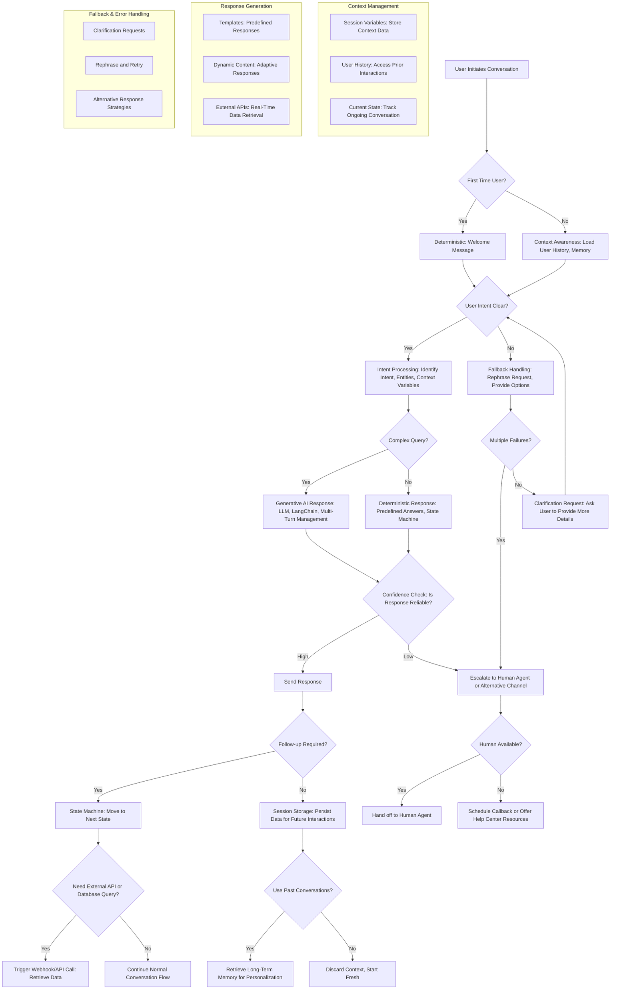

```mermaid
flowchart TD

  %% User Entry Points
  A[User Initiates Conversation] --> B{First Time User?}
  
  %% First-time user vs Returning user handling
  B -- Yes --> C[Deterministic: Welcome Message]
  B -- No --> D[Context Awareness: Load User History, Memory]
  
  %% Understanding User Intent
  C --> E{User Intent Clear?}
  D --> E

  %% If intent is clear, process it
  E -- Yes --> F[Intent Processing: Identify Intent, Entities, Context Variables]
  E -- No --> G[Fallback Handling: Rephrase Request, Provide Options]

  %% Handling fallback scenarios
  G --> Q{Multiple Failures?}
  Q -- Yes --> M[Escalate to Human Agent or Alternative Channel]
  Q -- No --> R[Clarification Request: Ask User to Provide More Details]
  R --> E

  %% Processing recognized intent
  F --> H{Complex Query?}
  H -- Yes --> I[Generative AI Response: LLM, LangChain, Multi-Turn Management]
  H -- No --> J[Deterministic Response: Predefined Answers, State Machine]

  %% Confidence Check for Response
  I --> K{Confidence Check: Is Response Reliable?}
  J --> K
  K -- High --> L[Send Response]
  K -- Low --> M

  %% Managing Session Continuity and Follow-Ups
  L --> N{Follow-up Required?}
  N -- Yes --> O[State Machine: Move to Next State]
  N -- No --> P[Session Storage: Persist Data for Future Interactions]

  %% External Integrations
  O --> Y{Need External API or Database Query?}
  Y -- Yes --> Z[Trigger Webhook/API Call: Retrieve Data]
  Y -- No --> AA[Continue Normal Conversation Flow]

  %% Personalization and Memory Usage
  P --> BB{Use Past Conversations?}
  BB -- Yes --> CC[Retrieve Long-Term Memory for Personalization]
  BB -- No --> DD[Discard Context, Start Fresh]

  %% Escalation Handling
  M --> EE{Human Available?}
  EE -- Yes --> FF[Hand off to Human Agent]
  EE -- No --> GG[Schedule Callback or Offer Help Center Resources]

  %% Parallel subgraphs
  subgraph "Context Management"
      S[Session Variables: Store Context Data]
      T[User History: Access Prior Interactions]
      U[Current State: Track Ongoing Conversation]
  end

  subgraph "Response Generation"
      V[Templates: Predefined Responses]
      W[Dynamic Content: Adaptive Responses]
      X[External APIs: Real-Time Data Retrieval]
  end

  subgraph "Fallback & Error Handling"
      HH[Clarification Requests]
      II[Rephrase and Retry]
      JJ[Alternative Response Strategies]
  end
```
