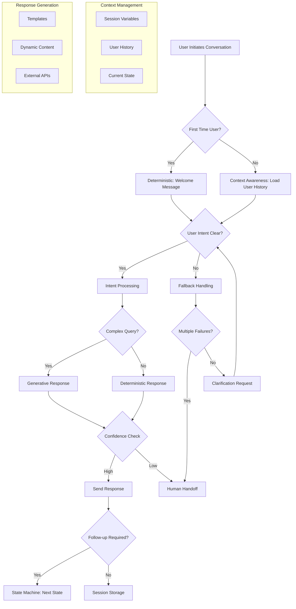

```mermaid
flowchart TB
    A[User Initiates Conversation] --> B{First Time User?}
    
    B -->|Yes| C[Deterministic: Welcome Message]
    B -->|No| D[Context Awareness: Load User History]
    
    C --> E{User Intent Clear?}
    D --> E
    
    E -->|Yes| F[Intent Processing]
    E -->|No| G[Fallback Handling]
    
    F --> H{Complex Query?}
    H -->|Yes| I[Generative Response]
    H -->|No| J[Deterministic Response]
    
    I --> K{Confidence Check}
    J --> K
    
    K -->|High| L[Send Response]
    K -->|Low| M[Human Handoff]
    
    L --> N{Follow-up Required?}
    N -->|Yes| O[State Machine: Next State]
    N -->|No| P[Session Storage]
    
    G --> Q{Multiple Failures?}
    Q -->|Yes| M
    Q -->|No| R[Clarification Request]
    
    R --> E
    
    subgraph "Context Management"
        S[Session Variables]
        T[User History]
        U[Current State]
    end
    
    subgraph "Response Generation"
        V[Templates]
        W[Dynamic Content]
        X[External APIs]
    end
```
