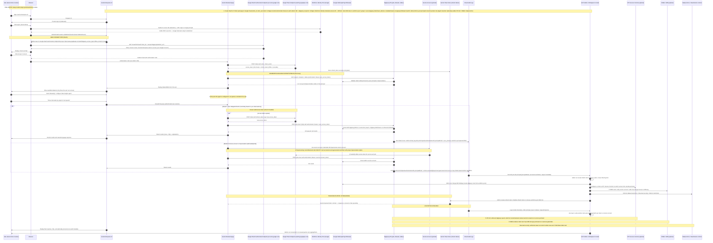

```mermaid
sequenceDiagram
  autonumber
  %% Participants
  participant User as User (Azure Entra / Human)
  participant Browser as Browser
  participant GeminiUI as Gemini Enterprise UI
  participant GeminiBackend as Gemini Backend (App)
  participant OAuthAuth as Google OAuth Authorization Endpoint (accounts.google.com)
  participant OAuthToken as Google Token Endpoint (oauth2.googleapis.com)
  participant WIF as Workforce Identity Pool (Google)
  participant GoogleIAM as Google IAM (Org/Project/Dataset)
  participant BigQuery as BigQuery API (jobs, datasets, tables)
  participant ServiceAccount as Service Account (optional)
  participant RefreshStore as Gemini Token Store (refresh tokens)
  participant AuditLogs as Cloud Audit Logs
  participant AdminConsole as GCP Admin / Workspace Console
  participant VPCSC as VPC Service Controls (optional)
  participant CMEK as CMEK / KMS (optional)
  participant DataGovern as Dataset ACLs / Row/Column controls

  Note over User,Browser: PRE-CONFIG: Setup & Admin steps performed before runtime
  Note over GeminiUI,AdminConsole: 1. Create OAuth 2.0 Client (web app) in Google Cloud (client_id, client_secret)\n2. Configure Gemini Authorization Resource with redirect URI + BigQuery scope\n3. Configure Workforce Identity Federation (Azure AD -> WIF)\n4. Grant IAM roles to workforce pool / groups / users (bigquery.dataViewer, jobUser, metadataViewer) at org/project/dataset level\n5. Add workforce-pool principal to Gemini product role (Agent User)\n6. Optionally enable VPC-SC / CMEK / Dataset ACLs

  %% User authenticates to Gemini product using Azure Entra federated login
  User->>Browser: Open Gemini Enterprise UI
  Browser->>GeminiUI: Request UI
  GeminiUI->>User: Present sign-in (federated)
  User->>Browser: Click sign in (Azure Entra)
  Browser->>WIF: Redirect to Azure AD (federation) -> WIF maps to Google principal
  WIF-->>Browser: SAML/OIDC assertion -> Google federated subject established
  Browser->>GeminiUI: Authenticated session established (Gemini knows federated user)

  Note over GeminiUI,User: USER CONSENT STEP (OAuth)
  GeminiUI->>Browser: Redirect user to Google OAuth Authorization Endpoint\n(scope: https://www.googleapis.com/auth/bigquery, access_type=offline, prompt=consent)
  Browser->>OAuthAuth: GET /o/oauth2/v2/auth?client_id=...&scope=bigquery&redirect_uri=...
  OAuthAuth->>Browser: Show consent screen ("Gemini Enterprise wants to access your Google Account")
  Browser->>User: Display consent prompt
  User->>Browser: Click Accept / Consent

  %% Authorization code flow exchange
  OAuthAuth-->>Browser: Redirect back with authorization code
  Browser->>GeminiBackend: Authorization code (via redirect URI)
  GeminiBackend->>OAuthToken: POST /token with code + client_secret
  OAuthToken-->>GeminiBackend: access_token (short-lived) + refresh_token (offline, revocable)
  GeminiBackend->>RefreshStore: Store refresh_token securely (encrypted)

  Note over GeminiBackend,GoogleIAM: ENUMERATE AVAILABLE DATASETS/TABLES (Discovery)
  GeminiBackend->>BigQuery: GET projects / datasets / tables (Authorization: Bearer user_access_token)
  BigQuery->>GoogleIAM: Validate caller's IAM permissions (user principal or impersonation)
  BigQuery-->>GeminiBackend: List of projects/datasets/tables visible to that principal
  GeminiBackend->>GeminiUI: Display dataset/table list to the user
  GeminiUI->>User: Show available datasets (only those the user can access)
  User->>GeminiUI: Select dataset(s) / configure Data Insights agent

  Note over GeminiBackend: At this point the agent is configured to run queries on behalf of the user

  %% RUNTIME: User issues an NL query to the Data Insights agent
  User->>GeminiUI: "Show total sales by region for last quarter"
  GeminiUI->>GeminiBackend: Forward NL query (authenticated user session)

  alt Model A: User-delegated OAuth (most likely based on your observations)
    Note over GeminiBackend,OAuthToken: Ensure valid access token (refresh if needed)
    alt Access token expired
      GeminiBackend->>OAuthToken: POST /token with refresh_token to get new access_token
      OAuthToken-->>GeminiBackend: new access_token
    end
    GeminiBackend->>BigQuery: POST jobs.insert (SQL) with Authorization: Bearer <user_access_token>
    BigQuery->>GoogleIAM: Check IAM: bigquery.jobUser on execution project + bigquery.dataViewer on referenced datasets
    BigQuery-->>GeminiBackend: Job queued / job results
    GeminiBackend->>GeminiUI: Return results (rows + SQL + explanation)
    GeminiUI->>User: Render results and natural language response
    BigQuery->>AuditLogs: Emit Data Access / Admin Activity log with protoPayload.authenticationInfo.principalEmail = user_email (or workforce principal identifier)
  else Model B: Service-account or impersonation (alternate/hybrid)
    GeminiBackend->>ServiceAccount: Use service account credentials OR impersonate service account
    Note over GeminiBackend,ServiceAccount: (If impersonating: GeminiBackend calls IAM API \n iam.serviceAccounts.generateAccessToken with proper impersonation rights)
    ServiceAccount->>OAuthToken: (if needed) obtain access token for service account
    GeminiBackend->>BigQuery: POST jobs.insert with Authorization: Bearer <service-account_token>
    BigQuery->>GoogleIAM: Check IAM for service account
    BigQuery-->>GeminiBackend: Job results
    GeminiBackend->>GeminiUI: Return results
    BigQuery->>AuditLogs: Emit log with protoPayload.authenticationInfo.principalEmail = service-account@project.iam.gserviceaccount.com (or may include impersonation metadata)
  end

  %% Auditing, token lifecycle & admin controls
  AuditLogs->>AdminConsole: Records job and principal (principalEmail, serviceAccountName, request metadata)
  AdminConsole->>AdminConsole: Admin can revoke OAuth client or refresh_token, review OAuth grants
  AdminConsole->>GoogleIAM: Admin can change IAM bindings (revoke bigquery roles from workforce pool)
  AdminConsole->>VPCSC: Configure or enforce VPC Service Controls to restrict access from outside perimeter
  AdminConsole->>CMEK: If CMEK used, verify service account / caller has decrypt access to KMS key
  AdminConsole->>DataGovern: Enforce dataset-level ACLs / Row-level security / Column restrictions

  Note over GeminiBackend,RefreshStore: TOKEN REVOCATION / OFFBOARDING
  AdminConsole->>RefreshStore: Admin revokes refresh token / disables OAuth client or removes workforce-pool IAM role
  RefreshStore--xGeminiBackend: Gemini backend fails to refresh -> requests re-consent or fails gracefully

  Note over BigQuery,AuditLogs: LOG DETAILS AVAILABLE
  AuditLogs->>AdminConsole: Logs include timestamp, caller principal, project, dataset, request/response
  AdminConsole->>AdminConsole: Use logs to verify whether calls were performed with user token or service account

  %% Optional security checks and protective controls shown
  Note over VPCSC,BigQuery: If VPC-SC enforced, BigQuery rejects calls from Gemini backend unless Gemini's network is in service perimeter
  Note over CMEK,BigQuery: If CMEK enabled, caller must have KMS decrypt permissions to read encrypted data
  Note over DataGovern,BigQuery: Row-level security, authorized views can restrict visible rows even if IAM allows table read

  %% Final states
  GeminiUI->>User: Display final response, SQL, and optionally provenance & audit metadata
  AdminConsole->>User: Admins can review/alert on unusual queries via Logging/Alerts

```
