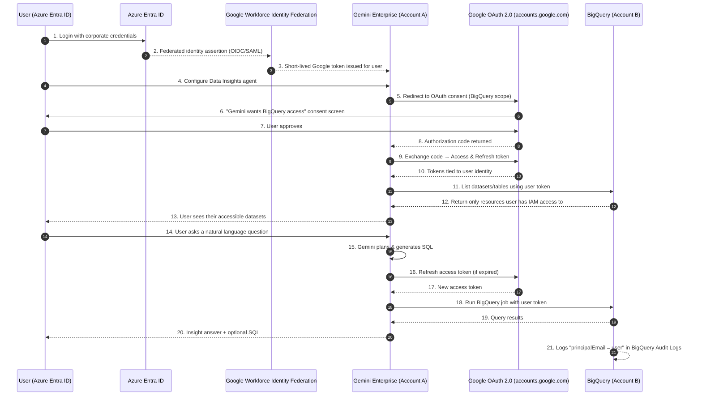

```mermaid
sequenceDiagram
    autonumber

    participant U as User (Azure Entra ID)
    participant AAD as Azure Entra ID
    participant WIF as Google Workforce Identity Federation
    participant GEM as Gemini Enterprise (Account A)
    participant OAUTH as Google OAuth 2.0 (accounts.google.com)
    participant BQ as BigQuery (Account B)

    %% --- Login / Product Access ---
    U->>AAD: 1. Login with corporate credentials
    AAD-->>WIF: 2. Federated identity assertion (OIDC/SAML)
    WIF-->>GEM: 3. Short-lived Google token issued for user

    %% --- OAuth Consent ---
    U->>GEM: 4. Configure Data Insights agent
    GEM->>OAUTH: 5. Redirect to OAuth consent (BigQuery scope)
    OAUTH->>U: 6. "Gemini wants BigQuery access" consent screen
    U->>OAUTH: 7. User approves
    OAUTH-->>GEM: 8. Authorization code returned
    GEM->>OAUTH: 9. Exchange code → Access & Refresh token
    OAUTH-->>GEM: 10. Tokens tied to user identity

    %% --- Dataset Discovery ---
    GEM->>BQ: 11. List datasets/tables using user token
    BQ-->>GEM: 12. Return only resources user has IAM access to
    GEM-->>U: 13. User sees their accessible datasets

    %% --- Runtime Querying ---
    U->>GEM: 14. User asks a natural language question
    GEM->>GEM: 15. Gemini plans & generates SQL
    GEM->>OAUTH: 16. Refresh access token (if expired)
    OAUTH-->>GEM: 17. New access token

    GEM->>BQ: 18. Run BigQuery job with user token
    BQ-->>GEM: 19. Query results
    GEM-->>U: 20. Insight answer + optional SQL

    %% --- Auditing ---
    BQ-->>BQ: 21. Logs "principalEmail = user" in BigQuery Audit Logs

```
