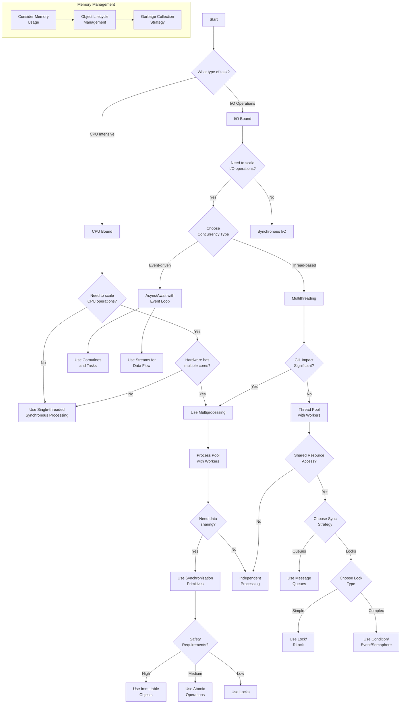

# Python-Infrastructure
Python Performance

https://medium.com/@adriensieg/how-many-cpu-cores-and-threads-do-i-need-to-run-a-web-app-interacting-with-gemini-2-0-90d56bc76e89

Header 1
 | 
Header 2
 | 
Header 3
 | 
Header 4
 | 
Header 5
 | 
Header 6
 | 
Header 7
 |
 |---------------------------------------------------|---------------------------------------------------|---------------------------------------------------|---------------------------------------------------|---------------------------------------------------|---------------------------------------------------|---------------------------------------------------|
 | Row 1, Cell 1                                     | Row 1, Cell 2                                     | Row 1, Cell 3                                     | Row 1, Cell 4                                     | Row 1, Cell 5                                     | Row 1, Cell 6                                     | Row 1, Cell 7                                     |
 | Row 2, Cell 1                                     | Row 2, Cell 2                                     | Row 2, Cell 3                                     | Row 2, Cell 4                                     | Row 2, Cell 5                                     | Row 2, Cell 6                                     | Row 2, Cell 7                                     |
 | Row 3, Cell 1                                     | Row 3, Cell 2                                     | Row 3, Cell 3                                     | Row 3, Cell 4                                     | Row 3, Cell 5                                     | Row 3, Cell 6                                     | Row 3, Cell 7                                     |

