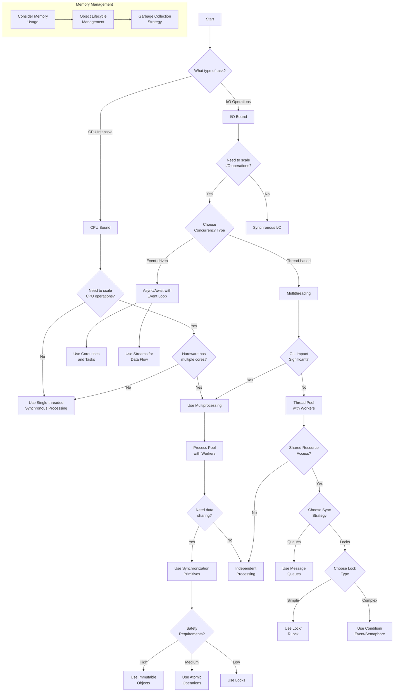

# Python Performance

My high-level decision tree that incorporates the key points into stages for any of my Python implementation. 

# Summary Table for Tactical Decisions

| Node               | Key Question                 | Purpose                                         | Code Example                |
|--------------------|------------------------------|------------------------------------------------|-----------------------------|
| Task Type          | CPU-bound or I/O-bound?      | Directs whether to focus on concurrency or parallelism. | Profiling with `cProfile`.  |
| Scaling CPU Ops    | Multi-core available?        | Leverage multi-processing for parallelism.     | `ProcessPoolExecutor`.      |
| Data Sharing       | Shared mutable data?         | Synchronize to prevent race conditions.        | `multiprocessing.Manager`.  |
| I/O Scaling        | Many I/O tasks?             | Use async for non-blocking concurrency.        | `asyncio` and `aiohttp`.    |
| Thread Safety      | Shared resource?             | Use locks for thread safety.                   | `threading.Lock`.           |
| Message Queues     | Asynchronous communication? | Decouple tasks with message queues.            | `multiprocessing.Queue`.    |

# My tactical Tree Decisions


# Summary of Tree Decisions

```
Problem Type:
├── I/O Bound
│   ├── Single User: Synchronous or asyncio (non-blocking)
│   └── Multi-user:
│       ├── Asyncio (concurrency)
│       └── Multi-threading (if sync APIs are unavoidable)
├── CPU Bound
│   ├── Multi-core: Multi-processing
│   └── Single-core: Optimize algorithms
Concurrency Needs:
├── Concurrency (e.g., async I/O or threading)
├── Parallelism (e.g., multi-processing)
│   └── Distributed Task Queue for horizontal scaling
Resource Sharing:
├── Shared Mutable State:
│   ├── Locks or Atomic Ops
│   ├── Minimize Locks (prefer immutability)
│   └── Debug Race Conditions, Deadlocks
└── No Shared State: Encapsulate Resources
```

# Tactical Decisions

## 1 - Task Type
### Is the task I/O-bound or CPU-bound?
- **I/O-bound**: Tasks that involve waiting for **external operations** like file reads/writes, database queries, API calls, etc.
    - Lean towards **asynchronous programming** with **coroutines**, **tasks**, and an **event loop** using libraries like <mark>asyncio</mark>.
    - Consider **threading** if the task benefits from **concurrency** but **doesn’t support** <mark>async</mark> natively.

- **CPU-bound**: Tasks that require heavy computation (e.g., image processing, machine learning models, cryptographic algorithms).
    - Lean towards **multi-processing** to **parallelize CPU-intensive work**.
 
- **Improvement**: Use profiling tools like **cProfile** to measure where the app spends time.

## 2 - Scaling CPU Operations (for *CPU-bound operations*)
### Can CPU-intensive tasks benefit from parallelism across multiple cores?
- **Parallelism** divides **tasks** across **multiple cores** to perform work **simultaneously**.
- Python’s Global Interpreter Lock **(GIL)** **limits threads for CPU work, so **multi-processing** is often a better choice.
- Use <mark>concurrent.futures.ProcessPoolExecutor</mark> for parallelism.

**Parallelism with Multiprocessing**
```python 
from concurrent.futures import ProcessPoolExecutor
import math

def cpu_task(n):
    return math.sqrt(n)

if __name__ == "__main__":
    with ProcessPoolExecutor() as executor:
        results = list(executor.map(cpu_task, range(1_000_000)))
```

Multiple processes to fully utilize multi-core CPU
```python 
import multiprocessing

def process_large_dataset(data_chunk):
    # Complex data processing logic
    return processed_data

def main():
    # Utilize multiple CPU cores
    with multiprocessing.Pool(processes=multiprocessing.cpu_count()) as pool:
        results = pool.map(process_large_dataset, large_dataset)
```

- <mark>multiprocessing.Pool</mark>:
    - Creates a **pool of worker processes**, utilizing **all available CPU cores** (<mark>multiprocessing.cpu_count()</mark>).
    - Allows **parallel execution** of process_large_dataset on different parts of large_dataset.
      
- </mark>pool.map(process_large_dataset, large_dataset)</mark>:
    - Distributes the dataset across **multiple processes**.
    - Each **process** executes process_large_dataset on a chunk of data.
    - Returns a list of processed results.
  
## 3 - Data Sharing in Multiprocessing
### Do tasks require shared data?
- Shared data needs synchronization to ensure consistency.
- Improper synchronization can lead to race conditions, deadlocks, or corrupt data.
- Use <mark>multiprocessing.Manager</mark> for **shared data** or **Queue** for **message passing**.

```python 
from multiprocessing import Manager, Process

def worker(shared_dict, key, value):
    shared_dict[key] = value

if __name__ == "__main__":
    with Manager() as manager:
        shared_dict = manager.dict()
        processes = [Process(target=worker, args=(shared_dict, f"key{i}", i)) for i in range(5)]
        for p in processes:
            p.start()
        for p in processes:
            p.join()
        print(shared_dict)
```

## 4 - I/O Scaling
### Do I/O tasks need to scale efficiently?
- Asynchronous programming uses <mark>asyncio</mark> to **avoid blocking on I/O** while **waiting** for data.
- Scaling I/O operations **improves throughput** and **minimizes idle time**.
- Use <mark>asyncio.gather</mark> for **concurrent I/O tasks**.

**Asyncio for Concurrent HTTP Requests**: 
```python 
import asyncio
import aiohttp

async def fetch(url):
    async with aiohttp.ClientSession() as session:
        async with session.get(url) as response:
            return await response.text()

async def main():
    urls = ["https://example.com" for _ in range(5)]
    results = await asyncio.gather(*[fetch(url) for url in urls])
    print(results)

if __name__ == "__main__":
    asyncio.run(main())
```

**Make concurrent HTTP requests**
```python 
import asyncio

async def fetch_url(url):
    async with aiohttp.ClientSession() as session:
        async with session.get(url) as response:
            return await response.text()

async def main():
    urls = ['http://example1.com', 'http://example2.com']
    tasks = [fetch_url(url) for url in urls]
    results = await asyncio.gather(*tasks)

asyncio.run(main())
```
- <mark>asyncio</mark> is a Python library that provides support for writing asynchronous code using <mark>async</mark> and <mark>await</mark>

Here is an example (DeepSeek): https://github.com/richardhe-fundamenta/practical-gcp-examples/blob/main/ollama-cloud-run/send_requests.py

## 5 - Thread Safety
### Are shared resources thread-safe?
- Thread-safety ensures that threads **do not corrupt shared data**.
- Avoids unpredictable bugs like **race conditions** or **deadlocks**.
- Use locks (<mark>threading.Lock</mark>) or thread-safe data structures like <mark>queue.Queue</mark>.

```python 
import threading

lock = threading.Lock()
counter = 0

# with lock: is a context manager that automatically acquires and releases the lock. Inside the locked section, we increment the counter
def increment():
    global counter
    with lock:
        counter += 1

# Here we create and run 100 threads:
threads = [threading.Thread(target=increment) for _ in range(100)]
for t in threads: t.start()

# Finally, we wait for all threads to complete and print the result
for t in threads: t.join()
print(counter)
```

The important concept here is **race condition prevention**. Without the lock, if **multiple threads tried to increment the counter at the same time**, some increments might be lost because the operation counter += 1 **isn't atomic**. 
The **lock ensures only one thread can increment the counter at a time**.
When you run this code, it will reliably print 100, because each of the 100 threads successfully increments the counter exactly once. Without the lock, you might get unpredictable results less than 100.

## 6 - Message Queues
### Do tasks need to communicate asynchronously?

- Message queues allow tasks to exchange data without shared memory.
- Decouples producers and consumers, enabling better scalability and reliability.
- Use <mark>queue.Queue</mark> for **threading** or <mark>multiprocessing.Queue<mark> for **processes**.

```python 
from multiprocessing import Process, Queue

def producer(queue):
    for i in range(5):
        queue.put(i)

def consumer(queue):
    while not queue.empty():
        print(queue.get())

if __name__ == "__main__":
    queue = Queue()
    p1 = Process(target=producer, args=(queue,))
    p2 = Process(target=consumer, args=(queue,))
    p1.start()
    p1.join()
    p2.start()
    p2.join()
```

# My Engineering core Rules

## Comparison: Asyncio, Multithreading, Multiprocessing, Concurrency, and Parallelism

| **Concept**          | **Pragmatic Definition**                                                                 | **Real-Life Applications**                                                                                       | **Python Concepts/Tools**                                     | **Efficiency Gain**                          | **Limitations**                                   | **Best Use Case**                                 | **Common Mistakes**                                      |
|-----------------------|-----------------------------------------------------------------------------------------|----------------------------------------------------------------------------------------------------------------|-------------------------------------------------------------|--------------------------------|------------------------------------|------------------------------------|------------------------------------------------|
| **Asyncio**           | Running tasks **one at a time**, but switching between them while waiting (e.g., I/O).   | - Web scraping where you wait for responses from many websites.<br>- Chat applications handling many users.<br>- Writing non-blocking code for APIs. | - asyncio library<br>- async/await keywords<br>- aiohttp (for HTTP requests)<br>- asyncio.run(), await, gather() | Reduces waiting time for I/O operations | Not ideal for CPU-heavy tasks | Best for I/O-bound tasks with many waiting periods | Blocking calls inside async functions |
| **Multithreading**    | Running multiple **threads** in the same process; best for tasks that spend time waiting. | - Real-time UI (updating progress bars while processing).<br>- Downloading multiple files concurrently.<br>- Chatbots processing inputs while listening. | - threading module<br>- Thread class<br>- concurrent.futures.ThreadPoolExecutor | Improves responsiveness in I/O-heavy apps | Threads share memory; potential race conditions | Best for I/O-bound tasks with shared state | Not managing thread safety (e.g., missing locks) |
| **Multiprocessing**   | Running multiple **processes**; ideal for CPU-heavy tasks that need full cores.          | - Data processing (image/video processing).<br>- Machine learning model training.<br>- Simulations like Monte Carlo. | - multiprocessing module<br>- Process class<br>- concurrent.futures.ProcessPoolExecutor | Utilizes multiple CPU cores for true parallelism | High memory usage due to separate processes | Best for CPU-bound computations | Spawning too many processes leading to overhead |
| **Concurrency**       | Managing tasks that can run **independently** (may not be simultaneous).                 | - Handling simultaneous requests in web servers.<br>- Messaging queues or event-driven architectures.<br>- Downloading/uploading files asynchronously. | - asyncio (for non-blocking tasks)<br>- threading (for I/O-bound concurrency) | Increases throughput of independent tasks | Can lead to complex debugging | Best when tasks can overlap without needing results immediately | Confusing concurrency with parallelism |
| **Parallelism**       | Running tasks **at the same time** on multiple processors/cores for maximum speed.       | - Large-scale data processing (e.g., splitting data to process on multiple CPUs).<br>- Parallel image processing on datasets.<br>- Scientific computations like matrix multiplications. | - multiprocessing module<br>- joblib for parallel loops<br>- Dask for parallel dataframes | Maximizes CPU usage for performance | Requires data splitting; potential overhead | Best for computationally expensive tasks that can be divided | Not handling process synchronization properly |

---
## Key Takeaways
1. **Asyncio**: Best for **I/O-bound tasks** where you're waiting a lot (e.g., network calls, file I/O). It **doesn't leverage multiple cores**.
2. **Multithreading**: Ideal for **I/O-bound tasks** where tasks wait often but also require background execution.
3. **Multiprocessing**: Go-to for **CPU-bound tasks** requiring heavy computation or true parallelism.
4. **Concurrency**: General umbrella term for tasks running **independently**, either asynchronously (e.g., `asyncio`) or multithreaded.
5. **Parallelism**: A subset of concurrency where tasks run **simultaneously** (e.g., via multiprocessing or multithreading).

# Dictionary of concepts


https://medium.com/@adriensieg/how-many-cpu-cores-and-threads-do-i-need-to-run-a-web-app-interacting-with-gemini-2-0-90d56bc76e89

