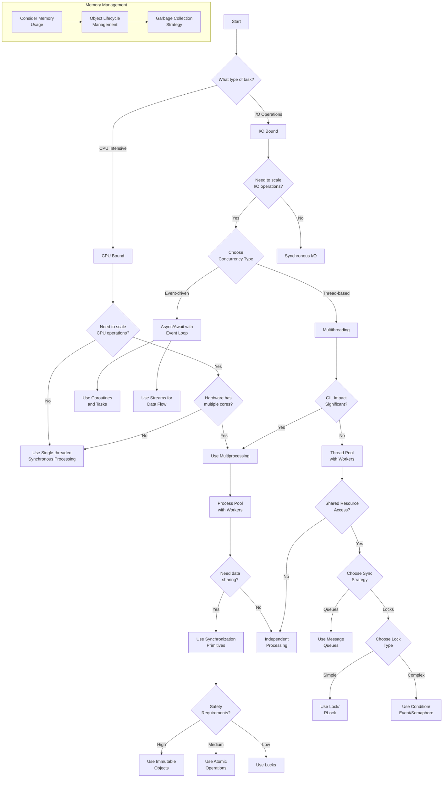

# Python Performance

My high-level decision tree that incorporates the key points into stages for any of my Python implementation. 

# Summary Table for Tactical Decisions

| Node               | Key Question                 | Purpose                                         | Code Example                |
|--------------------|------------------------------|------------------------------------------------|-----------------------------|
| Task Type          | CPU-bound or I/O-bound?      | Directs whether to focus on concurrency or parallelism. | Profiling with `cProfile`.  |
| Scaling CPU Ops    | Multi-core available?        | Leverage multi-processing for parallelism.     | `ProcessPoolExecutor`.      |
| Data Sharing       | Shared mutable data?         | Synchronize to prevent race conditions.        | `multiprocessing.Manager`.  |
| I/O Scaling        | Many I/O tasks?             | Use async for non-blocking concurrency.        | `asyncio` and `aiohttp`.    |
| Thread Safety      | Shared resource?             | Use locks for thread safety.                   | `threading.Lock`.           |
| Message Queues     | Asynchronous communication? | Decouple tasks with message queues.            | `multiprocessing.Queue`.    |

# My tactical Tree Decisions


# Summary of Tree Decisions

```
Problem Type:
├── I/O Bound
│   ├── Single User: Synchronous or asyncio (non-blocking)
│   └── Multi-user:
│       ├── Asyncio (concurrency)
│       └── Multi-threading (if sync APIs are unavoidable)
├── CPU Bound
│   ├── Multi-core: Multi-processing
│   └── Single-core: Optimize algorithms
Concurrency Needs:
├── Concurrency (e.g., async I/O or threading)
├── Parallelism (e.g., multi-processing)
│   └── Distributed Task Queue for horizontal scaling
Resource Sharing:
├── Shared Mutable State:
│   ├── Locks or Atomic Ops
│   ├── Minimize Locks (prefer immutability)
│   └── Debug Race Conditions, Deadlocks
└── No Shared State: Encapsulate Resources
```

# Tactical Decisions

## 1 - Task Type
### Is the task I/O-bound or CPU-bound?
- **I/O-bound**: Tasks that involve waiting for **external operations** like file reads/writes, database queries, API calls, etc.
    - Lean towards **asynchronous programming** with **coroutines**, **tasks**, and an **event loop** using libraries like <mark>asyncio</mark>.
    - Consider **threading** if the task benefits from **concurrency** but **doesn’t support** <mark>async</mark> natively.

- **CPU-bound**: Tasks that require heavy computation (e.g., image processing, machine learning models, cryptographic algorithms).
    - Lean towards **multi-processing** to **parallelize CPU-intensive work**.
 
- **Improvement**: Use profiling tools like **cProfile** to measure where the app spends time.

## 2 - Scaling CPU Operations (for *CPU-bound operations*)
### Can CPU-intensive tasks benefit from parallelism across multiple cores?
- **Parallelism** divides **tasks** across **multiple cores** to perform work **simultaneously**.
- Python’s Global Interpreter Lock **(GIL)** **limits threads for CPU work, so **multi-processing** is often a better choice.
- Use <mark>concurrent.futures.ProcessPoolExecutor</mark> for parallelism.

**Parallelism with Multiprocessing**
```python 
from concurrent.futures import ProcessPoolExecutor
import math

def cpu_task(n):
    return math.sqrt(n)

if __name__ == "__main__":
    with ProcessPoolExecutor() as executor:
        results = list(executor.map(cpu_task, range(1_000_000)))
```
## 3 - Data Sharing in Multiprocessing
### Do tasks require shared data?
- Shared data needs synchronization to ensure consistency.
- Improper synchronization can lead to race conditions, deadlocks, or corrupt data.
- Use <mark>multiprocessing.Manager</mark> for **shared data** or **Queue** for **message passing**.

```python 
from multiprocessing import Manager, Process

def worker(shared_dict, key, value):
    shared_dict[key] = value

if __name__ == "__main__":
    with Manager() as manager:
        shared_dict = manager.dict()
        processes = [Process(target=worker, args=(shared_dict, f"key{i}", i)) for i in range(5)]
        for p in processes:
            p.start()
        for p in processes:
            p.join()
        print(shared_dict)
```

## 4 - I/O Scaling
### Do I/O tasks need to scale efficiently?
- Asynchronous programming uses <mark>asyncio</mark> to **avoid blocking on I/O** while **waiting** for data.
- Scaling I/O operations **improves throughput** and **minimizes idle time**.
- Use <mark>asyncio.gather</mark> for **concurrent I/O tasks**.

Asyncio for Concurrent HTTP Requests: 
```python 
import asyncio
import aiohttp

async def fetch(url):
    async with aiohttp.ClientSession() as session:
        async with session.get(url) as response:
            return await response.text()

async def main():
    urls = ["https://example.com" for _ in range(5)]
    results = await asyncio.gather(*[fetch(url) for url in urls])
    print(results)

if __name__ == "__main__":
    asyncio.run(main())
```

## 5 - Thread Safety
### Are shared resources thread-safe?
- Thread-safety ensures that threads **do not corrupt shared data**.
- Avoids unpredictable bugs like **race conditions** or **deadlocks**.
- 
## 6 - Message Queues

https://medium.com/@adriensieg/how-many-cpu-cores-and-threads-do-i-need-to-run-a-web-app-interacting-with-gemini-2-0-90d56bc76e89

