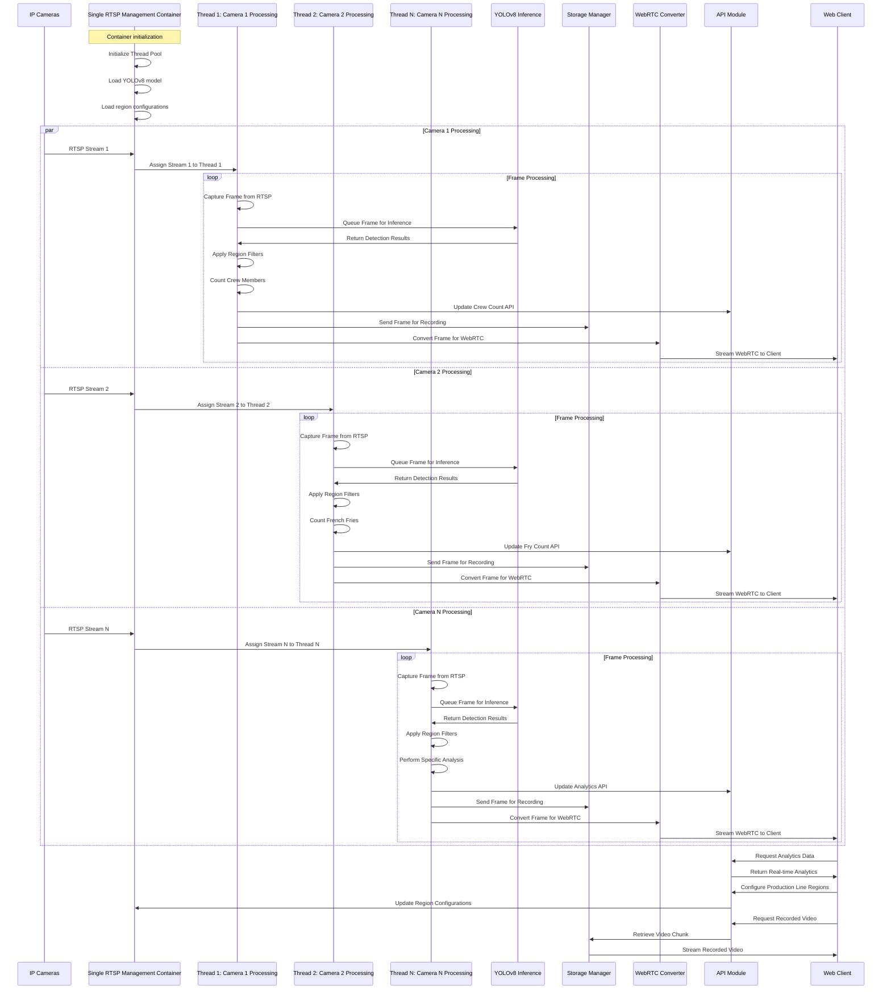

```mermaid

sequenceDiagram
    participant Camera as IP Cameras
    participant Container as Single RTSP Management Container
    participant Thread1 as Thread 1: Camera 1 Processing
    participant Thread2 as Thread 2: Camera 2 Processing
    participant ThreadN as Thread N: Camera N Processing
    participant YOLOv8 as YOLOv8 Inference
    participant Storage as Storage Manager
    participant WebRTC as WebRTC Converter
    participant API as API Module
    participant Client as Web Client
    
    Note over Container: Container initialization
    Container->>Container: Initialize Thread Pool
    Container->>Container: Load YOLOv8 model
    Container->>Container: Load region configurations
    
    par Camera 1 Processing
        Camera->>Container: RTSP Stream 1
        Container->>Thread1: Assign Stream 1 to Thread 1
        loop Frame Processing
            Thread1->>Thread1: Capture Frame from RTSP
            Thread1->>YOLOv8: Queue Frame for Inference
            YOLOv8->>Thread1: Return Detection Results
            Thread1->>Thread1: Apply Region Filters
            Thread1->>Thread1: Count Crew Members
            Thread1->>API: Update Crew Count API
            Thread1->>Storage: Send Frame for Recording
            Thread1->>WebRTC: Convert Frame for WebRTC
            WebRTC->>Client: Stream WebRTC to Client
        end
    and Camera 2 Processing
        Camera->>Container: RTSP Stream 2
        Container->>Thread2: Assign Stream 2 to Thread 2
        loop Frame Processing
            Thread2->>Thread2: Capture Frame from RTSP
            Thread2->>YOLOv8: Queue Frame for Inference
            YOLOv8->>Thread2: Return Detection Results
            Thread2->>Thread2: Apply Region Filters
            Thread2->>Thread2: Count French Fries
            Thread2->>API: Update Fry Count API
            Thread2->>Storage: Send Frame for Recording
            Thread2->>WebRTC: Convert Frame for WebRTC
            WebRTC->>Client: Stream WebRTC to Client
        end
    and Camera N Processing
        Camera->>Container: RTSP Stream N
        Container->>ThreadN: Assign Stream N to Thread N
        loop Frame Processing
            ThreadN->>ThreadN: Capture Frame from RTSP
            ThreadN->>YOLOv8: Queue Frame for Inference
            YOLOv8->>ThreadN: Return Detection Results
            ThreadN->>ThreadN: Apply Region Filters
            ThreadN->>ThreadN: Perform Specific Analysis
            ThreadN->>API: Update Analytics API
            ThreadN->>Storage: Send Frame for Recording
            ThreadN->>WebRTC: Convert Frame for WebRTC
            WebRTC->>Client: Stream WebRTC to Client
        end
    end
    
    Client->>API: Request Analytics Data
    API->>Client: Return Real-time Analytics
    
    Client->>API: Configure Production Line Regions
    API->>Container: Update Region Configurations
    
    Client->>API: Request Recorded Video
    API->>Storage: Retrieve Video Chunk
    Storage->>Client: Stream Recorded Video

```
